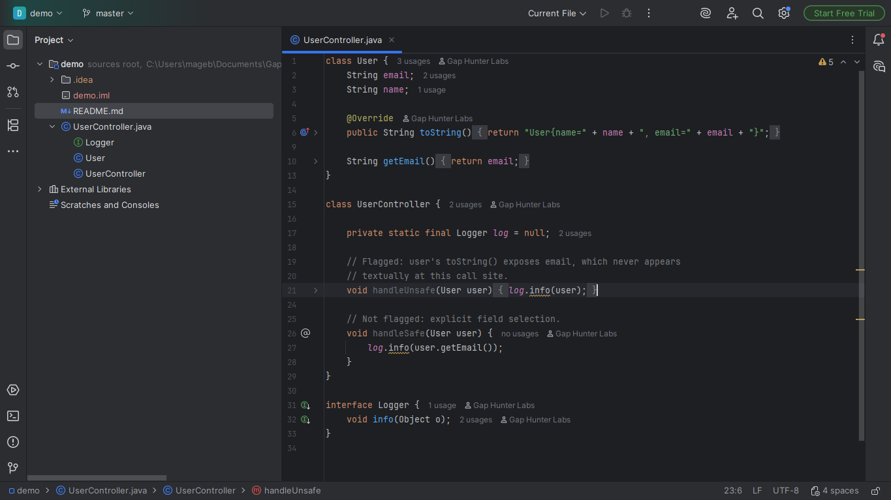
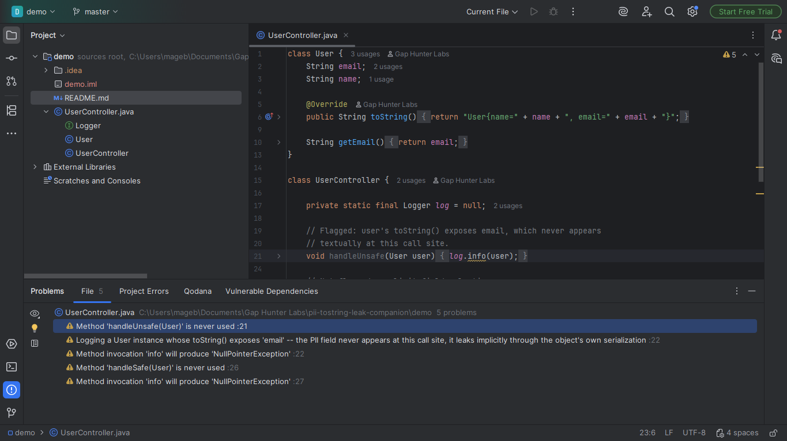

# PII via toString() Leak Companion

Warning on a logging/print call passed an instance of a class whose
`toString()` exposes a PII field (email, SSN, phone, date of birth,
credit card...) -- `toString()` on a user object often serializes the
whole model, unlike `log.info(user.getEmail())` which explicitly picks
only what should be logged.

## Screenshots





## Why it exists

A well-documented pattern of real incidents (Piiano, New Relic,
Guidewire Security): `toString()` on a user object often serializes
the entire model, including email, phone, and SSN. Different angle
from `pii-field-annotation-companion` (this catalog): that plugin
flags a PII field itself passed directly to a logger; here the field
never appears textually at the call site at all -- it leaks
implicitly through `toString()`'s serialization of the whole object.

## Why built this way

Two-step resolution: resolves the class's real `toString()` (generated
by the IDE, or Lombok's `@ToString`) to know which fields it exposes,
cross-referenced with the same PII lexicon already calibrated in
`pii-field-annotation-companion`.

- **Hand-written/IDE-generated `toString()`**: flagged if its body
  actually references the PII field's name.
- **Lombok `@ToString`**: includes every field by default -- flagged
  unless the field is marked `@ToString.Exclude`.
- Also covers implicit string concatenation
  (`log.info("User: " + user)`), not just a direct single argument.

## v0.1 scope — stated honestly, not exhaustively

Only `toString()` generated by the IDE or Lombok `@ToString` (a
predictable field-listing shape) -- a fully hand-written `toString()`
with arbitrary logic (e.g. a custom summary string) is out of scope.

## Usage

Open any Java file. A `log.info(user)`/`System.out.println(user)`-style
call passed an instance whose `toString()` exposes PII shows a warning.

## Enterprise / Team Licensing

Need enterprise features, custom rules, or team licensing? Contact us at
**gaphunterlabs@gmail.com**.

## Development

```
./gradlew test           # unit tests
./gradlew buildPlugin    # generates build/distributions/*.zip
./gradlew verifyPlugin   # checks compatibility against real IDEs
```

## License

Apache-2.0. See `LICENSE`.
